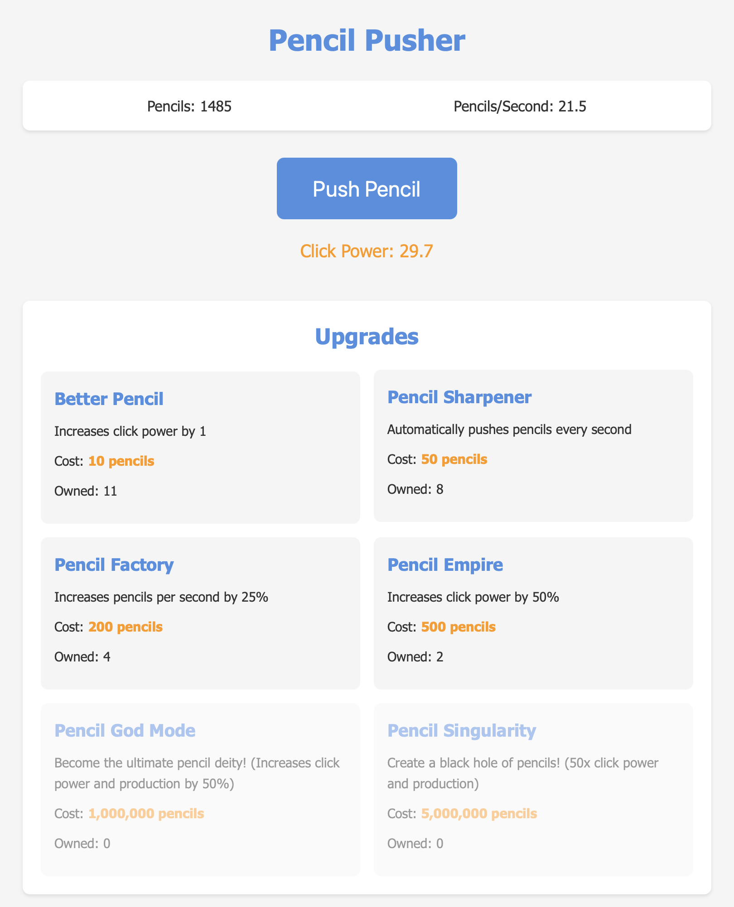

# Pencil Pusher

A whimsical incremental clicker game where you push pencils to unlock upgrades and achieve enlightenment! Built with vanilla JavaScript, HTML, and CSS.

## Getting Started

Visit the [GitHub Page](https://welbornt.github.io/pencil-pusher/) to play the game!

## Screenshot

## Game Overview

Pencil Pusher is an idle clicker game where you:
- Click to push pencils and earn more pencils
- Buy upgrades to increase your pencil production
- Achieve enlightenment to reset your progress for permanent bonuses
- Work towards the ultimate goal: the Cosmic Pencil!

## Features

- **Core Gameplay**
  - Click to push pencils
  - Automatic pencil production
  - Multiple upgrade paths
  - Enlightenment system with permanent bonuses

- **Upgrades**
  - Better Pencil: Increases click power
  - Pencil Sharpener: Automatically pushes pencils
  - Pencil Factory: Boosts production rate
  - Pencil Empire: Enhances click power
  - Pencil God Mode: Ultimate power boost
  - Pencil Singularity: Creates a black hole of pencils
  - Cosmic Pencil: The final achievement

- **Enlightenment System**
  - Reset progress for permanent bonuses
  - Increasing costs and rewards
  - Track your enlightenment count
  - Work towards the Cosmic Pencil

- **Save System**
  - Local storage for progress
  - Cookie consent management
  - Auto-save functionality
  - Option to revoke cookies

## Development

The project uses vanilla JavaScript, HTML, and CSS. No build tools or dependencies required!

### Project Structure
- `index.html` - Main game interface
- `game.js` - Game logic and mechanics
- `styles.css` - Game styling and animations

## Game Mechanics

### Pencil Production
- Click the main button to push pencils
- Upgrades increase your click power
- Automatic production increases over time

### Upgrades
- Each upgrade has a unique effect
- Costs increase with each purchase
- Some upgrades are hidden until certain conditions are met

### Enlightenment
- Reset your progress for permanent bonuses
- Each enlightenment increases your multiplier
- Requires more pencils for each subsequent enlightenment

### Cosmic Pencil
- The ultimate goal
- Requires multiple enlightenments
- Unlocks a special ending sequence

## Privacy

- Game progress is saved locally using browser storage
- No data is collected or shared
- Cookie consent can be revoked at any time

## License

This project is licensed under the MIT License - see the [LICENSE](LICENSE) file for details.

## Contributing

Contributions are welcome! Please feel free to submit a Pull Request.

## Contact

For questions or suggestions, please open an issue in the repository. 